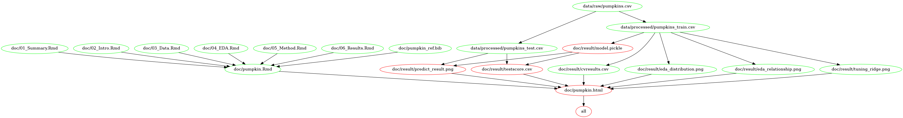

# Giant Pumpkins: weight prediction

-   **Authors:** Mahsa Sarafrazi, Rowan Sivanandam, Shiva Jena, and
    Vanessa Yuen

-   **Contributors:** Instructors, and Teaching Assistants of the course
    DSCI 522 of UBC Master of Data Science Vancouver program at the
    University of British Columbia, Vancouver

Analytical project prepared as part of the course DSCI 522 of the Master
of Data Science 2021-22 program at University of British Columbia,
Vancouver.

## About the project

This analytical project is an attempt at creating a machine learning
linear regression model to predict a continuous variable, weight of
giant pumpkins based on features such as type of pumpkin, place of
cultivation (country, city, state province, GPC site), seed origins,
pollinator father, etc.

### Background on Giant Pumpkins and GPC

The data set used in this project is originally from BigPumpkins.com.
The Great Pumpkin Commonwealth’s (GPC) mission promotes the hobby of
cultivating giant pumpkins throughout the world through standards and
regulations to ensure quality of fruit, fairness of competition,
recognition of achievement, fellowship and education for all
participating growers and weigh-off sites. (Read more from (“The Great
Pumpkin Commonwealth” 2021) [here](https://gpc1.org/ "GPC website") and
(“Bigpumpkins.com: A Giant Pumpkin Growing Community,” n.d.)
[here](http://www.bigpumpkins.com/ "Data on giant pumpkins from bigpumkins.com")).

### Raw data

The dataset is a public domain resource which pertains to the attributes
of giant pumpkins grown in around 20 countries across the world in
different regions. The raw data which was used in this project for the
analysis can be found
[here.](https://raw.githubusercontent.com/rfordatascience/tidytuesday/master/data/2021/2021-10-19/pumpkins.csv "Raw data")

### Predictive question and sub-questions

Given certain features of the seeds, place of cultivation, features of
the parent pumpkin etc, what will be estimated weight of the giant
pumpkin after harvesting?

To answer this predictive question, we need to first answer some
underlying data related questions such as:

-   Is there a relationship between features of the seeds, place of
    cultivation, and the weight of the pumpkins?

-   How are the weights distributed across regions?

## Method

The majority of the raw data comprises of features of the character type
where some of the features such as `id` contain important information
such as the pumpkin type. Therefore, in order to proceed, an initial
data cleaning, preparation and pre-processing is required to make the
features ready for training purposes. However, since the analysis is an
attempt to answer a machine learning prediction problem, the dataset is
first split into a 70/30 split for the training and test sets
respectively along with random seeding for reproducibility. Brief
details of the steps are mentioned below for an outline:

1.  **Train Test Split**  
    Splitting the dataset into train and test splits along with random
    seed for reproducibility.

    The desired outputs are a 70/30 split of training and test data.

2.  **Exploratory Data Analysis (EDA):**

    Data cleaning and preparation is required for making features ready
    for the machine learning regression model. An analysis of the trends
    and correlation with actual pumpkin weights and various features
    will be used using Python (Van Rossum and Drake 2009) and Altair
    (VanderPlas et al. 2018) as visualisation tools.

    On initial observations, the data seems to be mostly from the US.
    The distribution of the GPC sites, city and state/province are more
    evenly distributed. We consider these columns as good features to be
    used. Plots of the mean weight of giant pumpkins against different
    features (ott, country, city, state, gpc site) also suggest these
    features relates to the target (weight).

    The processed data sets in form of .csv files.

3.  **Predictive Modelling**

    The Ridge Linear Regression model will be used as pumpkin weight is
    a continuous, quantitative, numerical variable. The model is planned
    to be trained and tested using Scikit Learn (Pedregosa et al. 2011)
    packages.

    There are few numerical features and more categorical features. For
    numerical features, SimpleImputer and StandardScaler will be used
    during the preprocessing stage where as for categorical features,
    One-Hot Encoding and SimpleImputer for will ready the data for
    analysis.

    Using column transformers and pipe operators, cross-validation will
    be performed for hyperparameter optimization of sklearn’s
    LinearRegression model using GridSearchCV.

    After optimising the hyperparameters, the model will be fit on the
    training set and evaluation to be done on the test set. In the
    initial stages, the R-squared score will be the underlying metrics
    used to assess our model.

## Report

Results of the analysis can be found
[here](https://github.com/UBC-MDS/Giant_Pumpkins_Weight_Prediction/blob/main/doc/pumpkin.html)
.

## Usage

For replicating the analysis and usage, there are two ways:

##### 1. Using [Docker](https://hub.docker.com/r/imtvwy/giant_pumpkin_weight_prediction)

note - the instructions in this section also depends on running this in
a unix shell (e.g., terminal or Git Bash).

1.  Install [Docker](https://www.docker.com/get-started)

2.  Download/clone this repository in the path you have selected.

3.  Use the command line to navigate to the root of this
    downloaded/cloned repo

4.  Type the following:

    `docker run --rm -v "/$(pwd):/home/rstudio/pumpkin"  imtvwy/giant_pumpkin_weight_prediction make -C home/rstudio/pumpkin all`

5.  To reset/undo the analysis, type the following commands:

    `docker run --rm -v "/$(pwd):/home/rstudio/pumpkin"  imtvwy/giant_pumpkin_weight_prediction make -C home/rstudio/pumpkin clean`

##### 2. Without Using Docker

1.  Download/clone this repository and using the command line, navigate
    to the root of this project.

2.  install the project environment(`environment.yaml`)

3.  To run the analysis, type the following commands:

    `make all`

4.  To reset/undo the analysis, type the following commands:

    `make clean`

Below image can demonstrate the dependency diagram for making the report
by `Makefile`

 Fig.1 - Dependency Diagram

## Dependencies

The dependencies for this project can be found in
[`environment.yaml`](https://raw.githubusercontent.com/UBC-MDS/Giant_Pumpkins_Weight_Prediction/main/environment.yaml).

The yaml file needs to be run to create the environment required for
running the analysis. If conda is installed, the following command can
be run at the terminal/ command line from the root directory of this
project folder (“…/Giant_Pumpkins_Weight_Prediction/”) to install the
dependencies:

`conda activate pumpkin`

After having finished the work with our project, the following command
can be run to deactivate the environment in the terminal/command line:

`conda deactivate`

The list of dependencies are given below which are tentative and may
change as per updates in the environment file:

-   Python & Python libraries:

    `altair_saver==0.5.0=py_0`

    `requests[version='>=2.24.0']`

    `pandas[version='>=1.3.*']`

    `vega_datasets=0.9.0`

    `ipykernel=6.5.1`

    `altair==4.1.0=py_1`

    `graphviz=2.49.3`

    `python-graphviz=0.19`

    `scikit-learn[version='>=1.0']`

    `altair_data_server==0.4.1=py_0`

    `pandoc=2.16.2`

    `altair_viewer==0.4.0=pyhd8ed1ab_0`

    `matplotlib[version='>=3.2.2']`

    `docopt=0.6.2`

-   GNU make 4.2.1

For generating the plots in the report, install the following packages
with this command in the environment created:

`conda activate pumpkin` `npm install -g vega vega-cli vega-lite canvas`

If the above is already installed, the file may already exist and
therefore, it may throw an error asking to force install, which may be
ignored.

## References

“Bigpumpkins.com: A Giant Pumpkin Growing Community.” n.d.
*BigPumpkins.com: A Giant Pumpkin Growing Community*.
<http://www.bigpumpkins.com/>.

Pedregosa, F., G. Varoquaux, A. Gramfort, V. Michel, B. Thirion, O.
Grisel, M. Blondel, et al. 2011. “Scikit-Learn: Machine Learning in
Python.” *Journal of Machine Learning Research* 12: 2825–30.

“The Great Pumpkin Commonwealth.” 2021. *The Great Pumpkin Commonwealth
\| Our Organization Promotes Encourages and Promotes the Participation
in Growing Giant Fruits and Vegetables.* <https://gpc1.org/>.

Van Rossum, Guido, and Fred L. Drake. 2009. *Python 3 Reference Manual*.
Scotts Valley, CA: CreateSpace.

VanderPlas, Jacob, Brian Granger, Jeffrey Heer, Dominik Moritz, Kanit
Wongsuphasawat, Arvind Satyanarayan, Eitan Lees, Ilia Timofeev, Ben
Welsh, and Scott Sievert. 2018. “Altair: Interactive Statistical
Visualizations for Python.” *Journal of Open Source Software* 3 (32):
1057.

