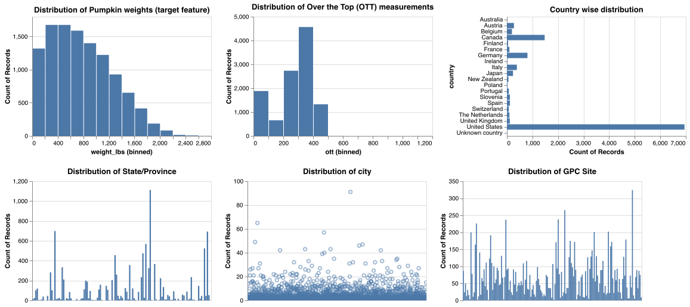
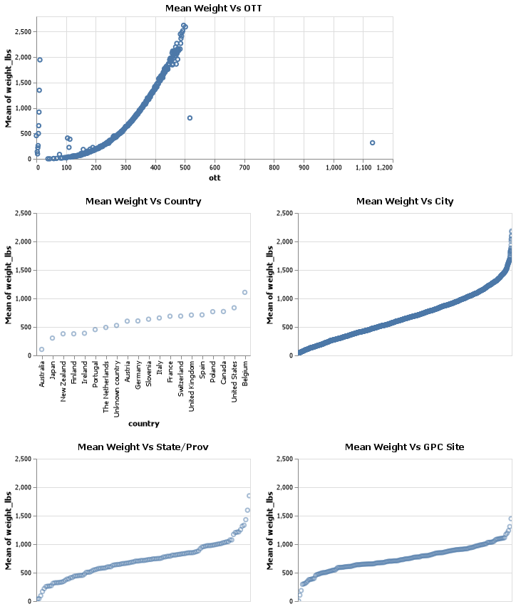

# EDA

We have used Altair [@vanderplas2018altair] to generate the visualization for our EDA.

## Distribution Plots

The following distribution plots are created to visualize the distribution of the weight_lbs (target) and the selected features. \
We have concluded the following findings from the above plot.

-   The majority weight of the giant pumpkins is between 0-1200lbs and the distribution is right-skewed. so in case imputation is needed, our strategy would not be filling the missing values ith mean.

-   Most of the giant pumpkins samples are from the United States and Canada which is reasonable based on the introduction that we have explained.

-   There are more samples coming from particular locations (state/province, city and GPC site).

## Pairwise Relationship with Prediction Target (Weight)

We have visualized the relationship between the giant pumpkin weight and the features we think relevant to the growth of giant pumpkins, including ott, country, city, state/province and GPC site.

\
From the above figure, we can see a strong, roughly linear relationship between weight and ott. And for the location features (country,city, state/provence and GPC site), the plots also indicates that the mean weight is higher for some particular locations.
