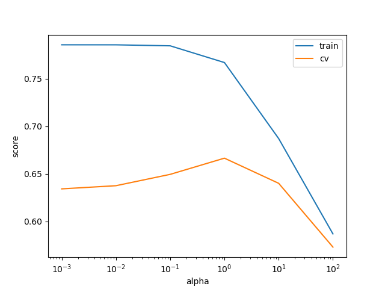
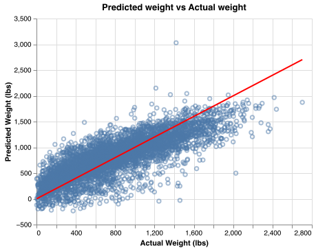

```{r read_score, echo=FALSE,include = FALSE}
result <- read_csv("result/cvresults.csv", show_col_types = FALSE)
best_alpha <- result$best_alpha
best_score_cv <- result$best_score
result <- read_csv("result/testscore.csv", show_col_types = FALSE)
test_score <- result$test_score
coeff <- read_csv("result/coeff.csv", show_col_types = FALSE, col_types = "_??")

```


# Results and Discussion

We report the result with the default scoring metric of Ridge, $R^2$.

We found the optimized `alpha` value of our Ridge model be
`r best_alpha`. In doing so, we were able to achieve a cross validation
score of `r best_score_cv`.

```{r hyperparameter_tuning, echo=FALSE, fig.cap="Figure 4. Hyperparameter Tuning for Ridge", out.width = '60%'}
library(knitr)

```

Our prediction model performed decently well on the test data as well.
The testing score we obtained with the testing set is `r test_score`.
Below graph shows the plot of the predicted weight (lbs) vs actual
weight (lbs) from the testing data set.

```{r predictin, echo=FALSE, fig.cap="Figure 5. Prediction weights vs Actual weights", out.width = '60%'}
library(knitr)

```

## Feature Importance
Table 2 below shows features with the largest coefficients (top 5) and smallest coefficients (bottom 5).  There are 9 out of 10 features are from the city feature.  Therefore, we can conclude that city (location) has the greatest impact in our weight prediction model.
```{r}
knitr::kable(coeff, caption="Table 2 : Feature Importance by Top 5 and Bottom 5 Coefficients")
```

## Critique, Limitations and Future Improvements

We faced several limitations in our analysis such as limited types of
features available for feature engineering and modelling. In addition,
many features had to be discarded due to their lack of relevance to our
model.

Future studies on this subject can be improved with the inclusion of
more relevant predictive features, such as using the seed/genetic data
of the father and mother, and more data. Additionally, further data
cleaning methods could also be applied, such as inspection and removal
of outliers, as these can affect regression model performance
significantly.

We were able to create a more accurate model with Random Forest to
predict weights of giant pumpkins but have opted to use the Ridge model
instead. We have chosen to do so as the Random Forest model required
upwards of 5 hours to run which we believe to be impractical and as such
have decided to use a slightly less accurate but a much faster model.
Thus, in the future, it could be worth looking into using alternative
regression models that may provide accurate and timely results.
