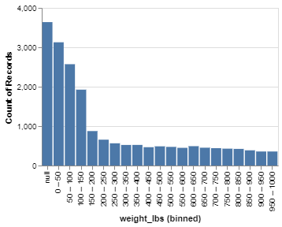

## Exploratory Data Analysis of the Giant Pumpkins data set

## Summary of the data set

The data set of this project is from [BigPumpkins.com](http://www.bigpumpkins.com/ViewArticle.asp?id=132). These statistics are from the Great Pumpkin Commonwealth's (GPC) Weighoff Results. It is sourced from the [TidyTuesday Data project](https://github.com/rfordatascience/tidytuesday) and the data set can be download [here](https://github.com/rfordatascience/tidytuesday/blob/master/data/2021/2021-10-19/readme.md).

Each row of the data set represents a GPC weighoff result. Each row includes the id (year-type), place/ranking, grower name, city, state, country, gpc site and variety of the giant pumpkin. It also contains genetic info such as the seed mother and pollinator father. Measurements taken include the weight in lbs and ott in inches (Over the top measurement to estimate weight).

In the raw data, there are rows of 'seperator' inserted after the records of the same 'id'. We have removed these separator records and saved the processed data in the `processed_pumpkins.csv`. A script file for this data processing can be found in [here](https://github.com/UBC-MDS/Giant_Pumpkins_Weight_Prediction/blob/main/src/script/download_data.py).

There are in total 28,011 observations and 14 features. Some null values found in the city, seed mother, pollinator father, ott, estimated weight, pct_chart and variety features. A summary statistics of the data set can be found in Figure 1 below.

### Summary Statistics

Summary of the data is given below:

```{r, echo=FALSE, fig.width = 4, fig.height = 3, fig.cap="Figure 1. Output of Descriptive Summary of the Training Set from Jupyter Notebook"}
knitr::include_graphics("files/train_df_describe_summary.PNG")
```

\newpage

## **Partition the data set into Training and Test sets**

We will split the data with 70% training data and 30% test data. After splitting, the number of observations in the training set and test set are 19,607 and 8,404 respectively.

## Exploratory Data Analysis on the Training set

We have plotted distribution of the target 'weight (Lbs)' and some features in the training set to explore if the features will be useful to predict the weight of the giant pumpkins.

```{r, echo=FALSE, fig.width = 4, fig.height = 3, fig.cap="Figure 2. Distribution of Weight (Lbs)"}

```


The distribution plot of Figure 3 below show that most of the observations are from the United States.

```{r, echo=FALSE, fig.width = 4, fig.height = 3, fig.cap="Figure 3. Distribution of Country"}
knitr::include_graphics("files/country_dist_plot.png")
```

The below distribution plot (Figure 4) shows the distribution of the numeric features, ott, est_weight and pct_chart.

```{r, echo=FALSE, fig.width = 4, fig.height = 3, fig.cap="Figure 4. Distribution of ott, est_weight and pct_chart"}
knitr::include_graphics("files/numeric_dist_plot.png")
```

The distribution plots of the GPC sites, city and state/province (Figure 5) are more evenly distributed. We consider these columns are all good features to be used.

```{r, echo=FALSE, fig.width = 4, fig.height = 3, fig.cap="Figure 5. Distribution of Location related features"}
knitr::include_graphics("files/dist_combined.png")
```

Plots of the mean weight of giant pumpkins against different features (ott, country, city, state, gpc site) (Figure 6) also suggest that these features relates to the target (weight).

```{r, echo=FALSE, fig.width = 4, fig.height = 3, fig.cap="Figure 6. Pairwise relationship between Mean Weight and selected features"}
knitr::include_graphics("files/correlation.png")
```

From the [Summary Statistics] of the training set (Figure 1), it is noticed that the grower name, seed mother and pollinator father are free-text columns. We think this genetic information might be useful for the prediction of the weight. It is found from the [GPC website](https://gpc1.org/about/resources/) that there is a naming convention for the seed / pollinator (Parent Weight : Grower Name: Year). We may consider to transform this data to separate features at later stage.

The number of non-null values in the variety column is very low. We will drop this column for training as the information may not be useful when there are so many null values.
