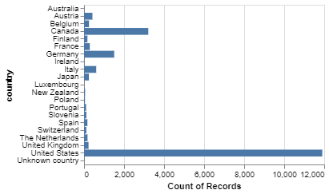
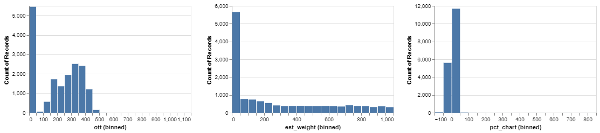

```{r setup, include=FALSE}
knitr::opts_chunk$set(echo = TRUE)
```

## Exploratory Data Analysis of the Giant Pumpkins data set

## Summary of the data set

The data set of this project is from [BigPumpkins.com](http://www.bigpumpkins.com/ViewArticle.asp?id=132). These statistics are from the Great Pumpkin Commonwealth's (GPC) Weighoff Results. It is sourced from the [TidyTuesday Data project](https://github.com/rfordatascience/tidytuesday) and the data set can be download [here](https://github.com/rfordatascience/tidytuesday/blob/master/data/2021/2021-10-19/readme.md).

Each row of the data set represents a GPC weighoff result. Each row includes the id (year-type), place/ranking of the pumpkin, grower name, city, state, country and gpc site of the giant pumpkin. It also contains genetic info such as the seed mother and pollinator father. Measurements taken include the weight in lbs and ott in inches (Over the top measurement to estimate weight).

In the raw data, there are rows of 'seperator' inserted after the records of the same 'id'. We have removed these separator records and saved the data in the `processed_pumpkins.csv`. R Script of the data processing can be found in ????.

There are in total 28,011 observations and 14 features. There are some null values found in the city, seed mother, pollinator father, ott, estimated weight, pct_chart and variety features.

### **Partition the data set into Training and Test sets**

We will split the data with 70% training data and 30% test data. After splitting, the number of observations in the training set is 19,607 and 8,404 respectively.

### Exploratory Data Analysis on the Training set

We have plotted distribution of some features in the training set to explore if the features will be useful to predict the weight of the giant pumpkins.

")




